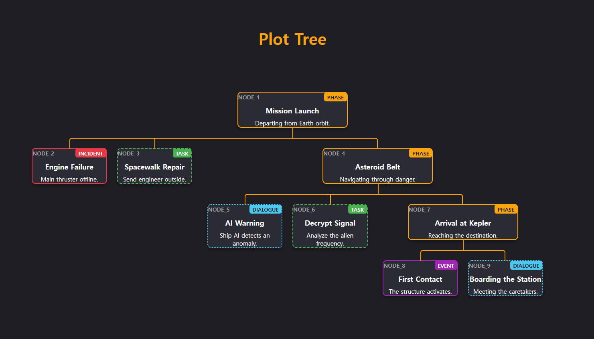

# PlotTree

A lightweight, zero-dependency vanilla JavaScript library for visualizing interactive narrative structures and branching storylines.



## Features

* **Zero Dependencies:** Built entirely with plain HTML, CSS, and JavaScript.
* **Flat Data Structure:** Manage and expand nodes easily via IDs without deep nesting.
* **Dynamic Styling:** Define visual styles purely through a JavaScript configuration object.
* **Interactive Modal:** Click on any node to view detailed attributes dynamically.
* **Decoupled Architecture:** Clean separation among Data, View, and Styles using CustomEvents.

## Quick Start

1. Clone or download this repository.
2. Open `index.html` in your web browser.
3. Edit `data/data.js` to build your own story tree.

## Configuration & Usage

Configure node visual properties in `data.js`. No CSS editing is required.


```javascript
// Define node types and their visual properties globally
const nodeTypeConfig =
{
    "Phase": { width: "220px", borderStyle: "solid", color: "#fca311", textColor: "#1e1e24" },
    "Incident": { width: "150px", borderStyle: "solid", color: "#e63946", textColor: "#ffffff" },
    "Task": { width: "150px", borderStyle: "dashed", color: "#4caf50", textColor: "#ffffff" }
};
```

Add your story nodes to the storyDataFlat array. Connect child nodes to their parents using parentID. Any custom properties can be added inside the detail object.


```js
// Flat data structure for the sci-fi story nodes
const nodes =
[
    {
        id: 1,
        parentID: null, // Root node
        type: "Phase",
        title: "Mission Launch",
        summary: "Departing from Earth orbit.",
        modalTitle: "Phase 1: Apollo Legacy",
        detail: {
            "Location": "Earth Orbit",
            "Crew Morale": "High",
            "Description": "The spaceship Horizon departs Earth."
        }
    },
    {
        id: 2,
        parentID: 1, // Connects to Node 1
        type: "Incident",
        title: "Engine Failure",
        summary: "Main thruster offline.",
        modalTitle: "Critical Incident: Thruster",
        detail: {
            "System Impact": "Speed reduced by 40%",
            "Casualties": "None"
        }
    }
];
```

## License
MIT License. Free to use and modify for personal and commercial projects.